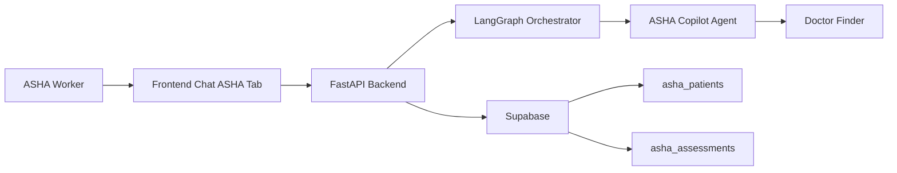
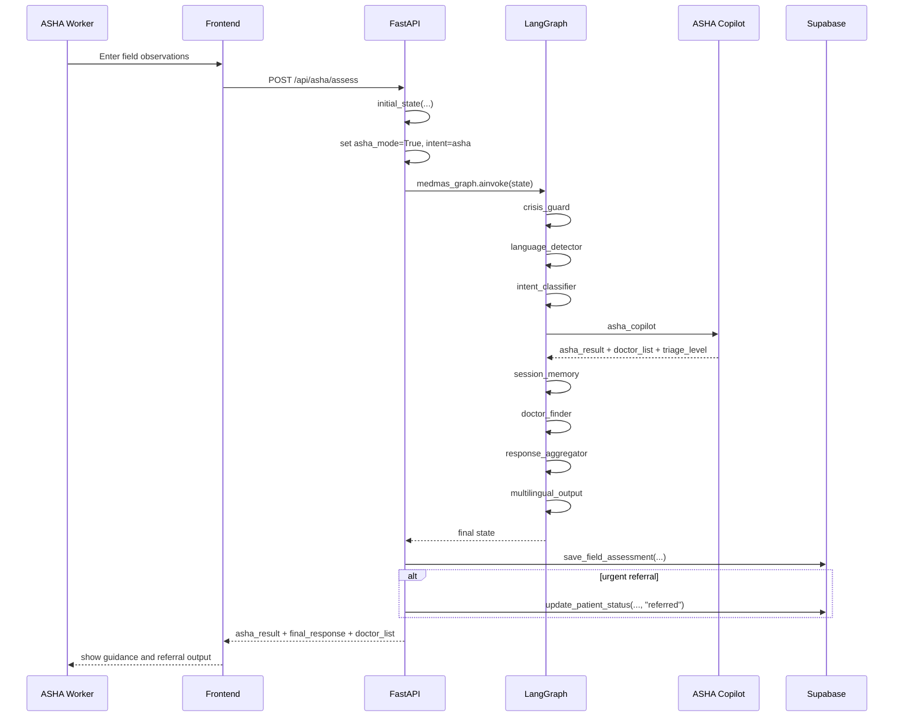
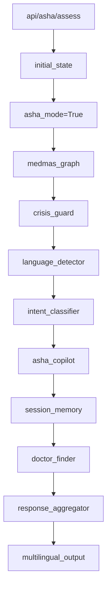
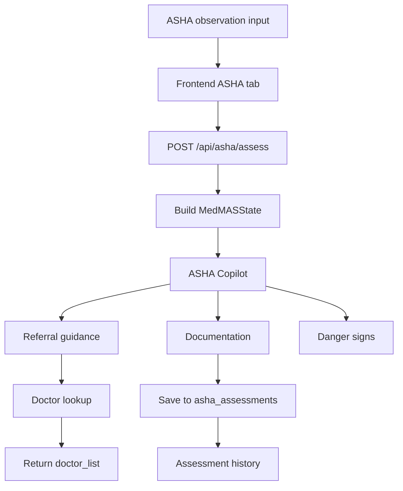

# MedMAS ASHA Worker Architecture

## Goal

This document describes the current ASHA Worker architecture in MedMAS.

It is focused on:

- how the ASHA flow enters the system
- how the backend routes ASHA assessments
- what the ASHA Copilot agent does
- how patient queue and assessment persistence work
- current strengths and limitations

## What This Feature Is

The ASHA Worker flow is the field-triage workflow for community health workers.

It is designed for:

- symptom observation entry in simple text
- patient referral guidance
- home-care advice
- auto-generated field documentation
- queue and history support through Supabase-backed endpoints

The active agent is implemented in [asha_copilot.py](/D:/MedMAS-AI/MedMAS/medmas/backend/agents/asha_copilot.py).

## High-Level Architecture



## Frontend Entry

The current frontend entry is the ASHA mode inside [Chat.jsx](/D:/MedMAS-AI/MedMAS/medmas/frontend/src/pages/Chat.jsx).

### Current frontend behavior

- the user switches from `Patient` to `ASHA` tab
- the input placeholder changes to patient field observations
- sample ASHA prompts are shown
- the frontend submits the request to `POST /api/asha/assess`

Current implementation detail:

- the frontend currently sends placeholder IDs:
  - `asha_worker_id = "demo-worker"`
  - `patient_id = "demo-patient"`

That means the current UI supports the ASHA workflow conceptually, but it is not yet connected to a real ASHA worker identity/session model.

## Backend ASHA Endpoints

The ASHA APIs are currently defined in [main.py](/D:/MedMAS-AI/MedMAS/medmas/backend/main.py).

### Current endpoints

- `GET /api/asha/queue/{worker_id}`
- `POST /api/asha/patient`
- `POST /api/asha/assess`
- `GET /api/asha/history/{patient_id}`

### Endpoint responsibilities

`GET /api/asha/queue/{worker_id}`
- fetches active patients assigned to an ASHA worker

`POST /api/asha/patient`
- adds a patient to the ASHA worker’s queue

`POST /api/asha/assess`
- runs the ASHA field assessment through the LangGraph flow
- persists the resulting assessment
- updates patient status when urgent referral occurs

`GET /api/asha/history/{patient_id}`
- returns past assessments for a patient

## Actual End-to-End ASHA Assessment Flow



## Orchestrator Routing

The ASHA flow is routed through the main LangGraph orchestrator in [orchestrator.py](/D:/MedMAS-AI/MedMAS/medmas/backend/orchestrator.py).

### How ASHA gets selected

There are two ways ASHA Copilot is reached:

1. `intent_classifier` returns `asha`
2. `asha_mode=True` forces ASHA routing

In the dedicated ASHA assessment endpoint, the backend explicitly sets:

- `state["asha_mode"] = True`
- `state["asha_worker_id"] = req.asha_worker_id`
- `state["patient_id"] = req.patient_id`
- `state["intent"] = "asha"`

So in practice, `POST /api/asha/assess` guarantees routing into the ASHA specialist path.

### Current orchestration path



## ASHA Copilot Agent

The ASHA Copilot agent is implemented in [asha_copilot.py](/D:/MedMAS-AI/MedMAS/medmas/backend/agents/asha_copilot.py).

### Agent purpose

It provides:

- field triage decision support
- referral destination guidance
- danger sign identification
- home-care advice
- auto-generated documentation
- a plain-language script the worker can speak to the patient

### Current prompt contract

The agent returns JSON with:

- `triage_decision`
- `refer_to`
- `refer_specialty`
- `urgency_hours`
- `clinical_summary`
- `danger_signs`
- `home_care_steps`
- `documentation`
- `asha_script`

### Current special rules in prompt

The current prompt explicitly handles:

- children under 5 with fever
- pregnant women with danger signs
- BP >= 140/90
- chest pain
- difficulty breathing

### Prior-context behavior

The agent can incorporate prior findings from:

- `symptom_result`
- `disease_result`
- `session_context`

That means the ASHA agent is able to use earlier MedMAS outputs if they are present in state.

## Current ASHA Result Shape

Typical current result:

```json
{
  "triage_decision": "refer_urgent | refer_routine | monitor_at_home",
  "refer_to": "PHC | CHC | District Hospital | Specialist",
  "refer_specialty": "General|Paediatrics|Obstetrics|Cardiology|Endocrinology",
  "urgency_hours": 2,
  "clinical_summary": "...",
  "danger_signs": ["..."],
  "home_care_steps": ["...", "..."],
  "documentation": {
    "chief_complaint": "...",
    "duration": "...",
    "key_vitals_noted": "...",
    "action_taken": "...",
    "follow_up_date": "..."
  },
  "asha_script": "..."
}
```

## Doctor and Facility Discovery

After the ASHA agent produces `refer_specialty`, doctor discovery is performed using the common doctor lookup path.

Current behavior:

- the ASHA agent itself calls `find_doctors(...)`
- then the outer graph still continues through `doctor_finder`
- but `doctor_finder` immediately returns if `doctor_list` already exists
- so in the current ASHA path, OSM upgrade does not happen after the agent result is produced

So the ASHA path currently reuses the same provider-discovery subsystem as patient chat.

## Current Breakpoints In The ASHA Flow

The current ASHA flow is implemented, but there are important breakpoints between the intended architecture and the real runtime behavior.

### 1. Frontend uses hardcoded demo identity

Current frontend request payload still sends:

- `asha_worker_id = "demo-worker"`
- `patient_id = "demo-patient"`

This means the ASHA flow is not yet connected to real worker identity or patient selection.

Code reference:

- [Chat.jsx](/D:/MedMAS-AI/MedMAS/medmas/frontend/src/pages/Chat.jsx#L279)
- [Chat.jsx](/D:/MedMAS-AI/MedMAS/medmas/frontend/src/pages/Chat.jsx#L283)

### 2. `monitor_at_home` is flattened into `moderate`

The ASHA agent supports three decisions:

- `refer_urgent`
- `refer_routine`
- `monitor_at_home`

But current code maps only:

- `refer_urgent -> urgent`
- everything else -> `moderate`

So `monitor_at_home` is not represented distinctly in `triage_level`.

Code reference:

- [asha_copilot.py](/D:/MedMAS-AI/MedMAS/medmas/backend/agents/asha_copilot.py#L26)
- [asha_copilot.py](/D:/MedMAS-AI/MedMAS/medmas/backend/agents/asha_copilot.py#L90)

### 3. OSM/live-location doctor improvement is effectively skipped for ASHA results

The ASHA agent itself returns `doctor_list`.

Then the shared `doctor_finder_node(...)` checks:

- if `doctor_list` already exists, return it unchanged

So even if `user_lat/user_lng` is present, the later OSM-aware doctor-finder step does not improve the ASHA provider list.

Code reference:

- [asha_copilot.py](/D:/MedMAS-AI/MedMAS/medmas/backend/agents/asha_copilot.py#L85)
- [orchestrator.py](/D:/MedMAS-AI/MedMAS/medmas/backend/orchestrator.py#L148)
- [orchestrator.py](/D:/MedMAS-AI/MedMAS/medmas/backend/orchestrator.py#L149)

### 4. Important ASHA fields are generated but not surfaced well in final output

The ASHA prompt generates:

- `home_care_steps`
- `documentation`
- `asha_script`

But the shared `response_aggregator` currently renders only:

- decision
- referral destination
- urgency
- clinical summary
- danger signs

So key ASHA-specific outputs are created, but not strongly exposed to the frontend user.

Code reference:

- [asha_copilot.py](/D:/MedMAS-AI/MedMAS/medmas/backend/agents/asha_copilot.py#L32)
- [asha_copilot.py](/D:/MedMAS-AI/MedMAS/medmas/backend/agents/asha_copilot.py#L44)
- [orchestrator.py](/D:/MedMAS-AI/MedMAS/medmas/backend/orchestrator.py#L279)

### 5. Queue and history APIs exist, but are not integrated into the active frontend flow

The backend supports:

- queue
- patient creation
- assessment history

But the active frontend ASHA UI currently only uses:

- `POST /api/asha/assess`

So the architecture is partially implemented at backend level, but not yet end-to-end in the UI.

Code reference:

- [main.py](/D:/MedMAS-AI/MedMAS/medmas/backend/main.py#L498)
- [main.py](/D:/MedMAS-AI/MedMAS/medmas/backend/main.py#L506)
- [main.py](/D:/MedMAS-AI/MedMAS/medmas/backend/main.py#L566)
- [Chat.jsx](/D:/MedMAS-AI/MedMAS/medmas/frontend/src/pages/Chat.jsx#L279)

## Actual Current Runtime Path

The real current ASHA path is:

```text
ASHA tab in frontend
-> sends observations with demo worker/patient IDs
-> POST /api/asha/assess
-> initial_state + force asha_mode
-> crisis_guard
-> language_detector
-> intent_classifier
-> asha_copilot
-> session_memory
-> doctor_finder (returns early because doctor_list already exists)
-> response_aggregator
-> multilingual_output
-> persist assessment in Supabase
-> frontend renders final_response and doctor cards
```

## Queue and Persistence Layer

The persistence logic is in [asha_service.py](/D:/MedMAS-AI/MedMAS/medmas/backend/services/asha_service.py).

### Supabase-backed tables used

- `asha_patients`
- `asha_assessments`

### Current service operations

`get_patient_queue(...)`
- fetch active patients for a worker

`add_patient(...)`
- insert a new patient into the worker queue

`save_field_assessment(...)`
- store triage decision, referral destination, documentation, and danger signs

`update_patient_status(...)`
- change patient status such as `active`, `referred`, or `resolved`

`get_assessment_history(...)`
- fetch patient assessment history

## Data Flow Diagram



## Current Strengths

- ASHA flow is explicitly supported in orchestrator and API design
- routing is deterministic when using the dedicated ASHA endpoint
- output is operationally useful, not just conversational
- documentation is generated in a structured form
- assessment persistence already exists
- queue and history APIs already exist

## Current Limitations

Main limitations today:

1. frontend uses demo IDs instead of real ASHA worker identity
2. queue management is not yet integrated into the active frontend UI
3. ASHA Copilot is still a single-prompt specialist internally
4. provider matching is still mostly doctor-centric rather than facility-centric
5. there is no explicit PHC/CHC/District Hospital directory layer yet
6. persistence is embedded directly from API handlers instead of a cleaner workflow service boundary
7. auth and role separation for ASHA workers is still thin

## Recommended Next Improvements

### Phase 1

- replace demo worker/patient IDs with real authenticated ASHA identity
- connect queue and patient creation flows to frontend UI
- expose assessment history in frontend

### Phase 2

- introduce facility-first referral mapping:
  - PHC
  - CHC
  - District Hospital
  - Specialist
- separate doctor lookup from facility lookup

### Phase 3

- split ASHA Copilot internally into:
  - danger-sign extractor
  - referral decision engine
  - documentation composer
  - patient-facing script generator

### Phase 4

- support recurring follow-up workflows
- add maternal-child care specific subflows
- add offline-friendly queue sync behavior

## Bottom Line

The current ASHA Worker architecture is already meaningful and operationally distinct from patient chat.

Current state:

`frontend ASHA mode -> dedicated ASHA assess API -> orchestrator -> ASHA Copilot -> shared post-processing -> persistence`

This is a solid early architecture for community-worker decision support, but it still needs:

- real ASHA identity integration
- facility-aware referral modeling
- UI support for queue/history workflows
- stronger surfacing of ASHA-specific outputs
- correction of current runtime breakpoints
