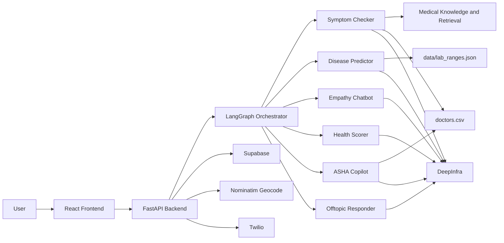
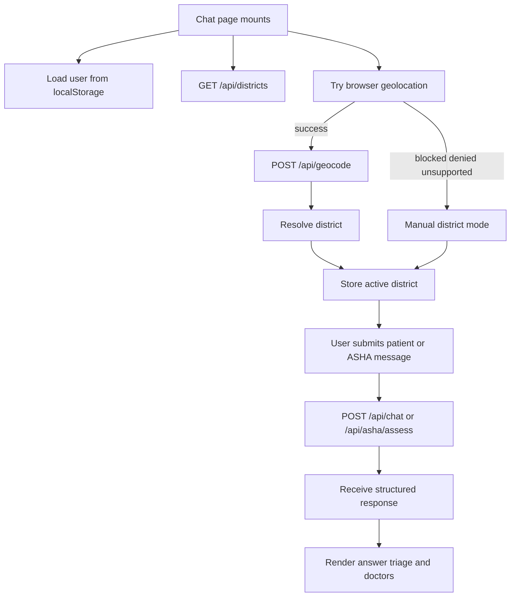
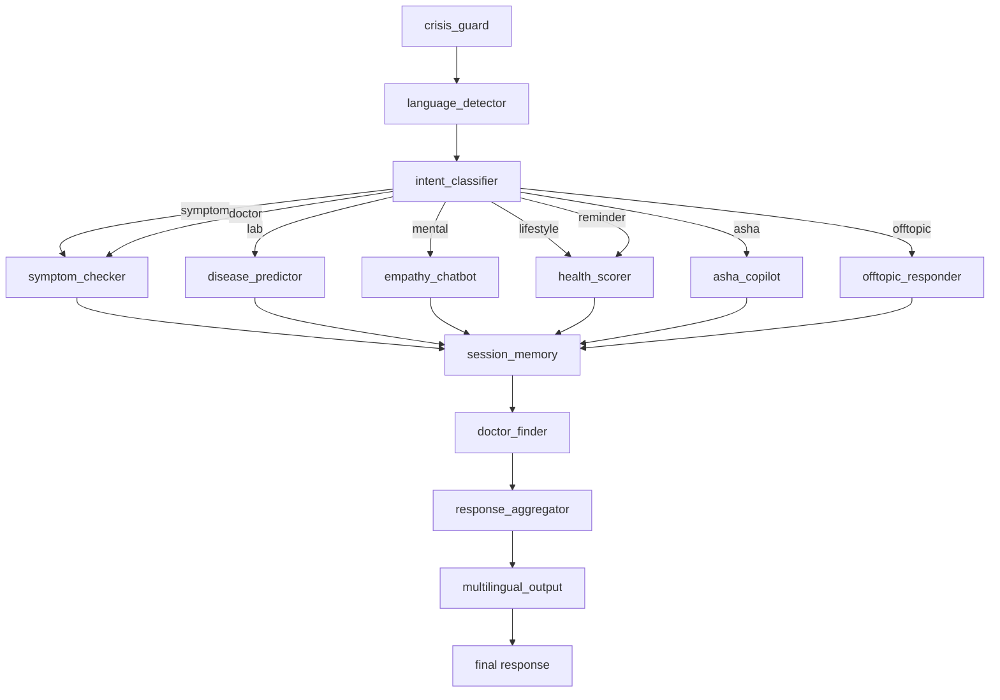
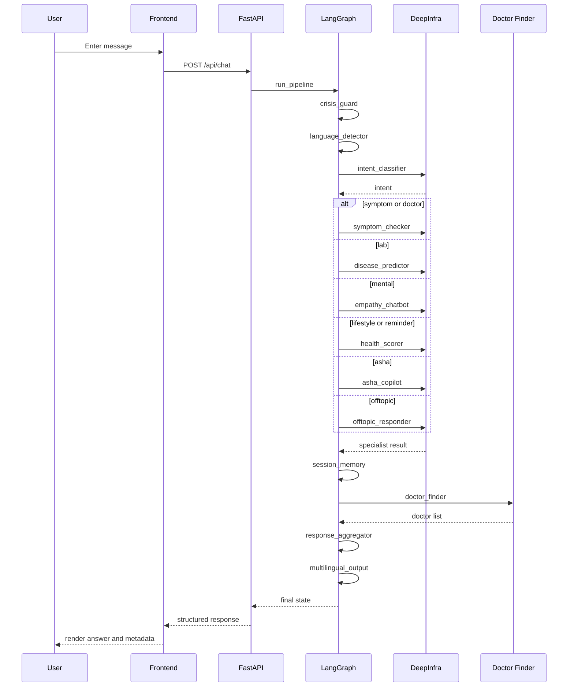
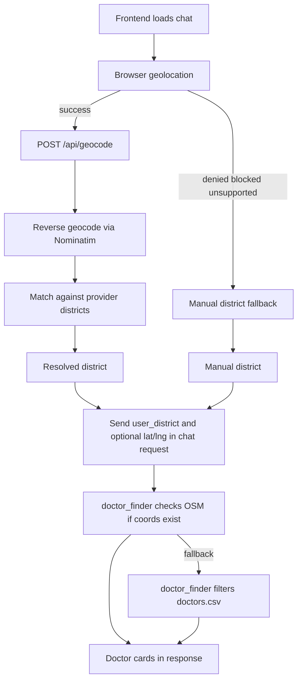
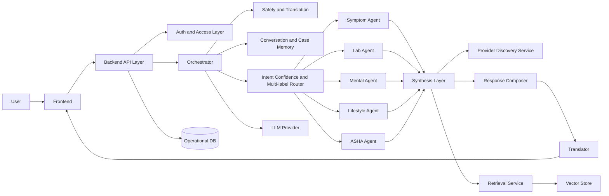

# MedMAS End-to-End Architecture

## Goal

This document explains the current MedMAS runtime architecture and the main changes needed to improve it into a team-safe, scalable platform.

It is focused on:

- current end-to-end product flow
- actual frontend and backend responsibilities
- LangGraph orchestration behavior
- location and provider discovery
- data and retrieval boundaries
- main architectural gaps
- future-state direction

## Executive Summary

MedMAS currently consists of:

- a React frontend
- a FastAPI backend
- a LangGraph orchestration layer in `backend/orchestrator.py`
- specialist health agents
- DeepInfra-backed model access
- Supabase persistence and auth
- Nominatim reverse geocoding
- OpenStreetMap-based nearby doctor lookup
- static provider and lab datasets

The most important architectural reality today is:

`the system is orchestrated, but most requests still run through one primary specialist path rather than a truly collaborative multi-agent workflow`

## High-Level System Architecture



## Repository Shape

Current repo layout:

```text
MedMAS/
  .gitignore
  medmas/
    backend/
    frontend/
    data/
    docs/
    .env
    .env.example
```

### Assessment

This works, but it is not ideal for a company-scale team.

Main issue:

- the real app root is nested inside `medmas/` instead of living at repo root

Better target:

```text
MedMAS/
  backend/
  frontend/
  data/
  docs/
  scripts/
  .env.example
  README.md
```

This is mainly a maintainability and contributor-experience problem.

## Frontend Architecture

### Current active frontend

The active product surface is `frontend/src/pages/Chat.jsx`.

It currently owns:

- patient and ASHA modes
- message state
- district list loading
- browser geolocation
- geocode fallback messaging
- chat request submission
- triage and doctor-card rendering
- local auth state from `localStorage`

### Frontend runtime flow



### Frontend assessment

Strengths:

- straightforward user flow
- graceful location fallback
- backend returns UI-usable metadata

Weaknesses:

- `Chat.jsx` is too large
- there is no dedicated frontend API layer
- there is no separation between location, chat, and rendering concerns

Recommended split:

- `hooks/useLocationDistrict`
- `hooks/useChatApi`
- `components/chat/MessageList`
- `components/chat/Composer`
- `components/chat/DoctorCards`
- `components/chat/StatusBanner`

## Backend Architecture

### Current backend

The backend entrypoint is `backend/main.py`.

The orchestration and state contracts live separately in:

- `backend/orchestrator.py`
- `backend/state.py`

It currently owns:

- chat endpoint
- lab upload endpoint
- doctor endpoint
- nearby doctor endpoint
- geocode and district endpoints
- crisis resource endpoint
- OTP endpoints
- signup and login
- reminder and health-score endpoints
- history endpoint
- ASHA endpoints

### Backend assessment

This is the largest maintainability issue in the repo.

The backend works, but `main.py` mixes too many product domains. That will become a merge-conflict hotspot for a larger team.

Better target:

```text
backend/
  app/
    api/
      chat.py
      auth.py
      location.py
      doctors.py
      reminders.py
      history.py
      asha.py
    core/
      config.py
      security.py
    orchestration/
      graph.py
      routing.py
    agents/
    services/
    state/
    main.py
```

## Orchestration Architecture

### Current graph



### Current behavior

The system is:

- safety-first
- translation-first
- single-intent routed
- single-primary-agent
- shared post-processing

That means the product is modular and routed, but not deeply collaborative in the multi-agent sense.

More concretely, the runtime path today is:

- `crisis_guard`
- `language_detector`
- `intent_classifier`
- one routed specialist node
- `session_memory`
- `doctor_finder`
- `response_aggregator`
- `multilingual_output`

### Strengths

- clear runtime graph
- easy to debug
- deterministic safety node
- easy to add a specialist path
- doctor lookup can use live coordinates when available

### Weaknesses

- only one main specialist path per request
- no parallel specialist execution
- no synthesis layer across specialist outputs
- request-scoped memory only

## End-to-End Chat Flow



### Core takeaway

Today, MedMAS behaves like:

`router -> one specialist -> shared memory -> doctor lookup -> response aggregation -> translation`

That is a good prototype architecture, but not yet a mature multi-agent platform architecture.

## Agent Layer

Current specialist roles:

- Symptom Checker: triage, likely diagnoses, specialty recommendation
- Disease Predictor: lab parsing, disease risk, urgency
- Empathy Chatbot: emotional support and escalation
- Health Scorer: preventive score plus actions
- ASHA Copilot: field triage and documentation
- Offtopic Responder: safe redirect

### Assessment

The role definitions are good. The main opportunity is not to add more agent types first, but to improve:

- routing depth
- synthesis
- shared memory
- confidence handling

## Data and Retrieval Architecture

Current main data sources:

- `data/doctors.csv`
- `data/lab_ranges.json`
- `backend/knowledge_base/medical_docs/*.txt`

Current retrieval/provider behavior:

- symptom flows can use the local medical knowledge base
- doctor discovery prefers live OSM lookup when `user_lat/user_lng` is present
- doctor discovery falls back to `data/doctors.csv` by district and specialty

### Current concern

Retrieval is the least stable architectural area right now. Provider, embedding, vector, and collection assumptions need more explicit ownership and versioning.

Recommended retrieval subsystem:

```text
backend/
  retrieval/
    collection_manager.py
    embedding_registry.py
    index_builder.py
    migration_checks.py
```

Persist metadata for:

- embedding provider
- embedding model
- vector dimension
- collection/index version
- corpus version

## Location and Provider Discovery



### Assessment

Good:

- practical
- safe fallback
- easy to explain
- supports both live-location and district-only flows

Weak:

- district-only matching
- limited ranking and quality scoring
- no availability or quality scoring

## Auth and Persistence

Current flow:

- signup uses OTP verification plus Supabase signup
- login uses Supabase password auth
- frontend stores token in localStorage
- backend writes health logs to Supabase

### Assessment

Functional, but not yet platform-rigorous.

Main concerns:

- localStorage-only auth state
- limited visible route protection discipline
- persistence logic embedded directly in API handlers
- OTP state is kept in process memory, so it is not durable across restarts

## Main Architectural Gaps

1. repo root is not aligned with app root
2. `backend/main.py` is too broad
3. runtime is mostly single-primary-agent
4. retrieval architecture needs stronger versioning
5. frontend chat page is too large
6. memory and state are still request-scoped in practice
7. platform engineering discipline is thin

## Recommended Improvement Roadmap

### Phase 1: Team-safe structure

1. flatten repo root
2. split backend routes by domain
3. clean duplicate or artifact files
4. standardize setup docs and envs
5. add CI, tests, lint, and formatting

### Phase 2: Runtime reliability

1. add structured error envelopes
2. validate provider config at startup
3. formalize retrieval metadata and migrations
4. move persistence behind service or repository boundaries

### Phase 3: Real multi-agent evolution

1. support multi-label routing
2. allow parallel specialist execution
3. add synthesis after specialist outputs
4. add confidence-aware fallback logic

### Phase 4: Better care-path intelligence

1. store lat/lng plus district
2. rank providers by distance
3. enrich provider data
4. add stronger ASHA and longitudinal patient workflows

## Target Future-State Architecture



## Bottom Line

MedMAS already has the correct product primitives:

- specialist health roles
- orchestration
- safety-first flow
- multilingual support
- provider discovery
- ASHA workflow

The next improvement should focus on:

- modularity for team contribution
- stabilized retrieval and provider boundaries
- deeper orchestration with synthesis
- stronger auth, state, and platform engineering discipline

Current state:

`strong prototype architecture`

Desired state:

`modular, team-safe, synthesis-driven health platform`

