# MedMAS End-to-End Architecture

## Goal

This document explains the current MedMAS runtime architecture and the main changes needed to improve it into a team-safe, scalable platform.

It is focused on:

- current end-to-end product flow
- actual frontend and backend responsibilities
- newly added speech-to-text chat flow
- newly implemented Symptom Checker pipeline
- LangGraph orchestration behavior
- location and provider discovery
- data and retrieval boundaries
- user-specific workflows (Patient, ASHA Worker, Doctor)
- consult-a-doctor and prescription systems
- main architectural gaps
- future-state direction

## Executive Summary

MedMAS currently consists of:

- a React frontend with three distinct user portals
- a FastAPI backend
- a LangGraph orchestration layer in `backend/orchestrator.py`
- specialist health agents
- DeepInfra-backed model access
- DeepInfra-backed speech-to-text via `openai/whisper-large-v3`
- Supabase persistence and auth
- Nominatim reverse geocoding
- OpenStreetMap-based nearby doctor lookup
- static provider and lab datasets

The most important architectural reality today is:

`the system is orchestrated, but most requests still run through one primary specialist path rather than a truly collaborative multi-agent workflow`

One notable exception is that the Symptom Checker is no longer a single-shot prompt. It now has an internal multi-step pipeline while still appearing as one specialist node in the top-level graph.

## User Types and Roles

MedMAS serves three distinct user types:

| User Type | Role Description | Key Features |
|-----------|-----------------|--------------|
| **Patient** | General health-seeking user | Symptom analysis, doctor lookup, consultation request |
| **ASHA Worker** | Community health field worker | Patient queue management, field assessment, AI triage |
| **Doctor** | Healthcare provider | Case management, patient communication, prescriptions |

## High-Level System Architecture

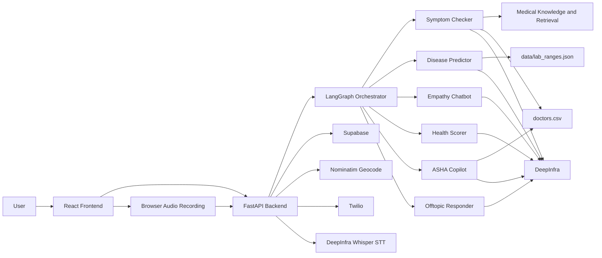

## Repository Shape

Current repo layout:

```text
MedMAS/
  .gitignore
  medmas/
    backend/
    frontend/
    data/
    docs/
    .env
    .env.example
```

### Assessment

This works, but it is not ideal for a company-scale team.

Main issue:

- the real app root is nested inside `medmas/` instead of living at repo root

Better target:

```text
MedMAS/
  backend/
  frontend/
  data/
  docs/
  scripts/
  .env.example
  README.md
```

This is mainly a maintainability and contributor-experience problem.

## Frontend Architecture

### Current Active Frontends

The system now has three distinct frontend portals:

#### 1. Patient Portal - Chat.jsx
- patient and ASHA modes (tab-switchable)
- message state with session management
- district list loading
- browser geolocation
- browser microphone capture via `MediaRecorder`
- speech transcription request flow
- geocode fallback messaging
- chat request submission
- triage and doctor-card rendering
- consult-a-doctor inline flow
- local auth state from `localStorage`
- Supabase-backed session persistence

#### 2. Doctor Portal - DoctorDashboard.jsx
- case queue management
- unassigned case browsing
- case detail view with chat thread
- prescription writing
- status transitions (assign → accept → start → complete → close)

#### 3. Authentication Pages
- Signup.jsx - Patient registration
- Login.jsx - Patient login
- DoctorSignup.jsx - Doctor registration
- DoctorLogin.jsx - Doctor login

### Frontend Runtime Flow - Patient

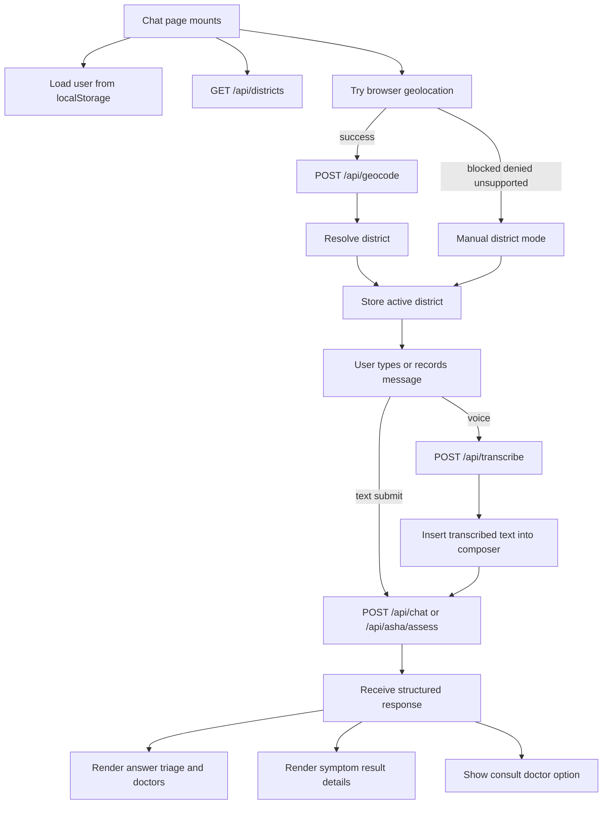

### Frontend Runtime Flow - ASHA Worker

```mermaid
flowchart TD
    A[Switch to ASHA tab] --> B[Load patient queue from API]
    B --> C[GET /api/asha/queue/{worker_id}]
    C --> D[Display patient list]
    D --> E[Select patient from queue]
    E --> F[Load assessment history]
    F --> G[GET /api/asha/history/{patient_id}]
    G --> H[Display previous assessments]
    H --> I[Enter field observations]
    I --> J[POST /api/asha/assess]
    J --> K[AI returns triage and recommendations]
    K --> L[Display ASHA result with actions]
    L --> M[Option to create new patient]
```

### Frontend Runtime Flow - Doctor

```mermaid
flowchart TD
    A[Doctor logs in] --> B[Load dashboard]
    B --> C[Fetch assigned cases]
    C --> D[GET /api/cases/doctor/{doctor_id}]
    D --> E[Display case list]
    E --> F[Select case from queue]
    F --> G[View case details]
    G --> H[View symptoms summary and AI suggestion]
    H --> I[View consultation thread]
    I --> J[Send message to patient]
    J --> K[POST /api/cases/{id}/messages]
    K --> L[Write prescription]
    L --> M[POST /api/prescriptions]
    M --> N[Transition case status]
    N --> O[Accept/Start/Complete/Close]
```

### Frontend Assessment

Strengths:

- clear user-specific flows
- graceful location fallback
- backend returns UI-usable metadata
- voice input is now supported without changing the main chat contract
- session-based chat with Supabase persistence
- consult-a-doctor inline flow
- prescription system for doctors

Weaknesses:

- `Chat.jsx` is too large (~1300 lines)
- there is no dedicated frontend API layer
- there is no separation between location, voice, chat, and rendering concerns

Recommended split:

- `hooks/useLocationDistrict`
- `hooks/useSpeechToText`
- `hooks/useChatApi`
- `components/chat/MessageList`
- `components/chat/Composer`
- `components/chat/DoctorCards`
- `components/chat/StatusBanner`
- `components/chat/ConsultDoctor`
- `components/asha/PatientQueue`
- `components/asha/AssessmentHistory`
- `components/doctor/CaseList`
- `components/doctor/PrescriptionForm`

## Backend Architecture

### Current Backend

The backend entrypoint is `backend/main.py`.

The orchestration and state contracts live separately in:

- `backend/orchestrator.py`
- `backend/state.py`

It currently owns:

- chat endpoint (`/api/chat`)
- chat with file upload (`/api/chat/upload`)
- session management (`/api/chat/sessions`)
- consultation management (`/api/chat/consultation`)
- case management (`/api/cases`)
- lab upload endpoint (`/api/lab`)
- audio transcription endpoint (`/api/transcribe`)
- doctor endpoint (`/api/doctors`)
- nearby doctor endpoint (`/api/doctors/nearby`)
- geocode and district endpoints (`/api/geocode`, `/api/districts`)
- crisis resource endpoint (`/api/crisis`)
- OTP endpoints (`/api/auth/otp/*`)
- signup and login (`/api/auth/signup`, `/api/auth/login`)
- reminder and health-score endpoints
- history endpoint (`/api/history`)
- ASHA endpoints (`/api/asha/*`)
- prescription endpoints (`/api/prescriptions`)

### Backend Assessment

This is the largest maintainability issue in the repo.

The backend works, but `main.py` mixes too many product domains. That will become a merge-conflict hotspot for a larger team.

Better target:

```text
backend/
  app/
    api/
      chat.py
      transcription.py
      auth.py
      location.py
      doctors.py
      cases.py
      prescriptions.py
      reminders.py
      history.py
      asha.py
    core/
      config.py
      security.py
    orchestration/
      graph.py
      routing.py
    agents/
    services/
    state/
    main.py
```

## Orchestration Architecture

### Current Graph

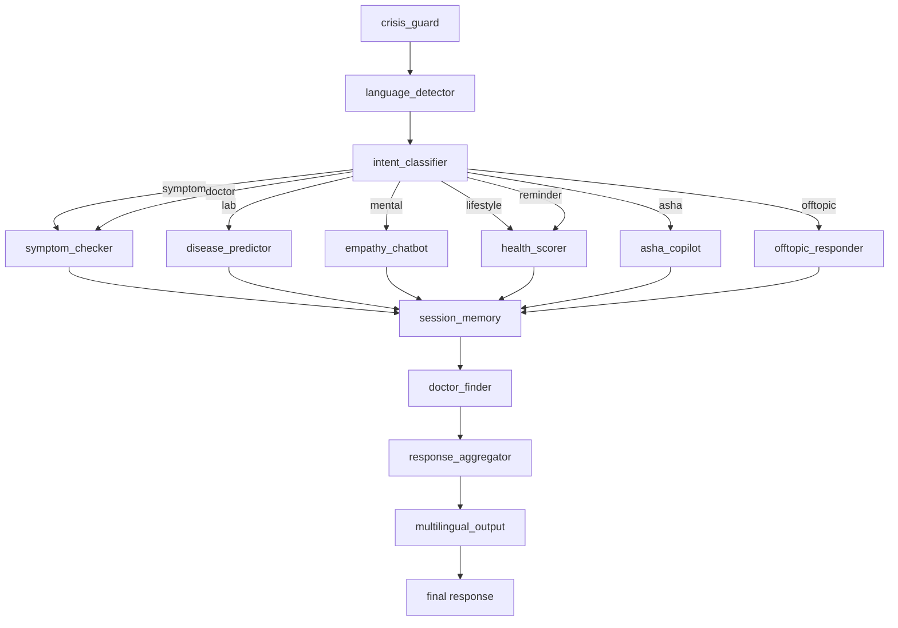

### Current Behavior

The system is:

- safety-first
- translation-first
- single-intent routed
- single-primary-agent
- shared post-processing

That means the product is modular and routed, but not deeply collaborative in the multi-agent sense.

More concretely, the runtime path today is:

- `crisis_guard`
- `language_detector`
- `intent_classifier`
- one routed specialist node
- `session_memory`
- `doctor_finder`
- `response_aggregator`
- `multilingual_output`

Speech-to-text is currently outside the LangGraph path. It happens before `/api/chat` and simply converts browser audio into text.

### Strengths

- clear runtime graph
- easy to debug
- deterministic safety node
- easy to add a specialist path
- doctor lookup can use live coordinates when available

### Weaknesses

- only one main specialist path per request
- no parallel specialist execution
- no synthesis layer across specialist outputs
- request-scoped memory only

## End-to-End Chat Flow - Patient

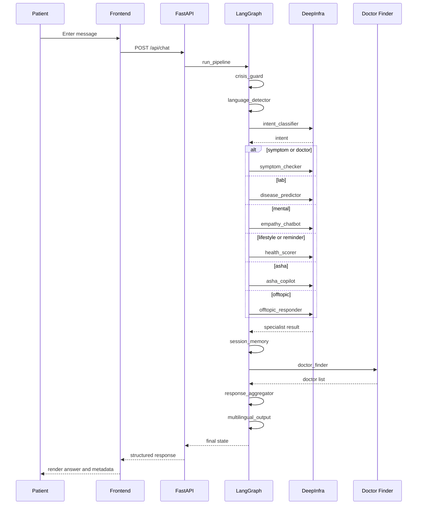

## Consult-A-Doctor Flow

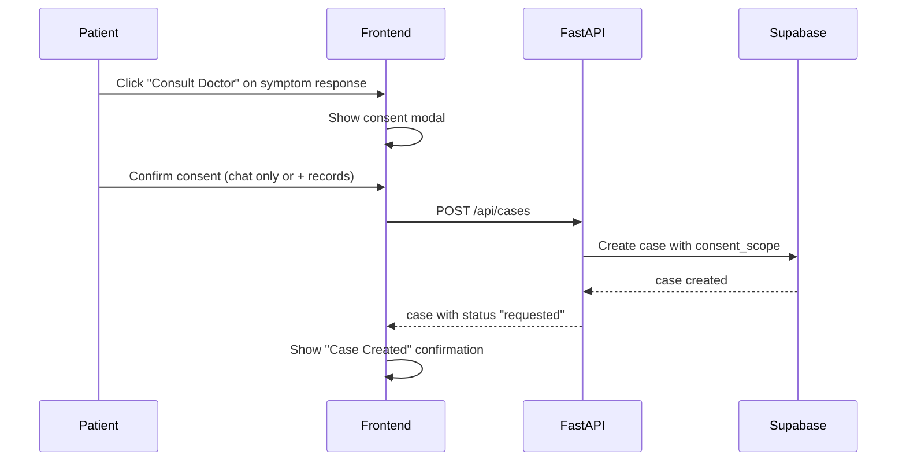

## End-to-End Voice Chat Flow

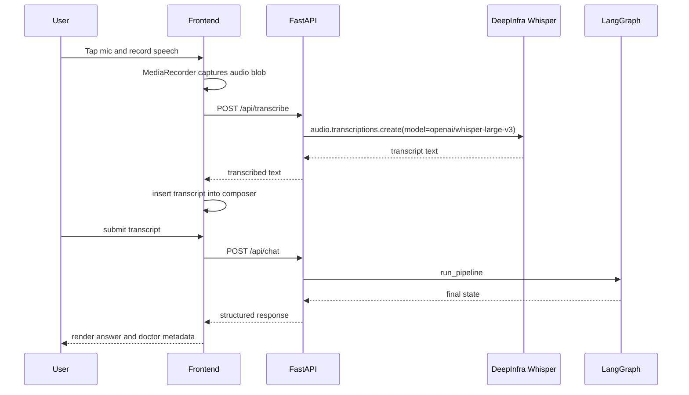

### Voice Flow Notes

- browser audio is recorded in the frontend using `MediaRecorder`
- the frontend uploads recorded audio as `multipart/form-data`
- backend transcription is handled by `POST /api/transcribe`
- STT is provider-backed, but intentionally decoupled from the LangGraph runtime
- the transcript becomes plain chat input after transcription completes

## ASHA Worker Flow

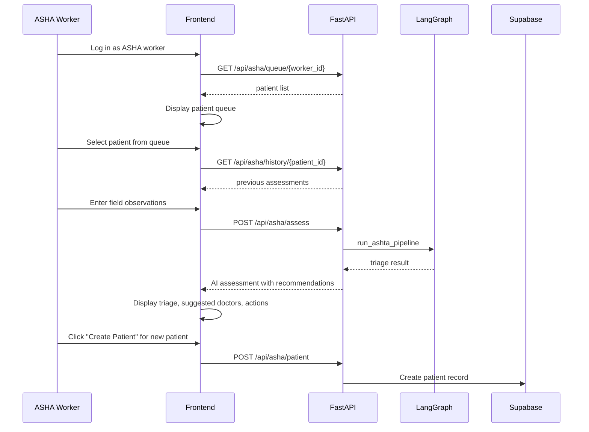

### ASHA API Endpoints

- `GET /api/asha/queue/{worker_id}` - Fetch patient queue
- `POST /api/asha/patient` - Create new patient
- `GET /api/asha/history/{patient_id}` - Get patient assessment history
- `POST /api/asha/assess` - Submit field observations for AI assessment
- `GET /api/asha/selected-patient/{worker_id}` - Get currently selected patient
- `POST /api/asha/selected-patient` - Persist selected patient

## Doctor Dashboard Flow

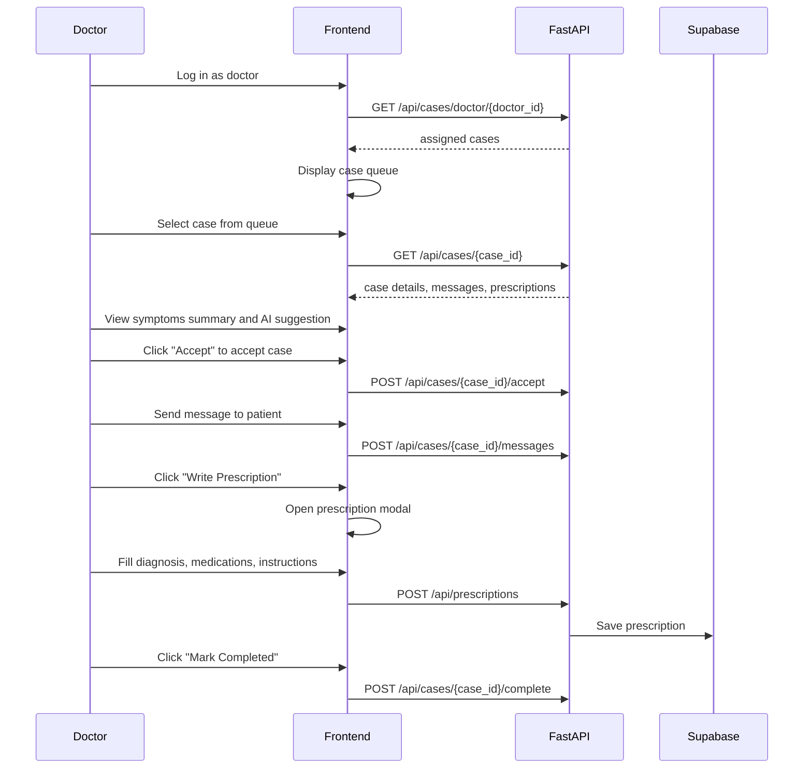

### Doctor API Endpoints

- `GET /api/cases/doctor/{doctor_id}` - Get doctor's assigned cases
- `GET /api/cases/unassigned` - Browse open cases
- `GET /api/cases/{case_id}` - Get case details
- `POST /api/cases/{case_id}/assign` - Assign case to doctor
- `POST /api/cases/{case_id}/accept` - Accept case
- `POST /api/cases/{case_id}/start` - Start consultation
- `POST /api/cases/{case_id}/complete` - Complete consultation
- `POST /api/cases/{case_id}/close` - Close case
- `POST /api/cases/{case_id}/messages` - Send message
- `POST /api/prescriptions` - Write prescription

## Agent Layer

Current specialist roles:

- Symptom Checker: structured symptom extraction, red-flag checks, differential reasoning, triage, specialty recommendation
- Disease Predictor: lab parsing, disease risk, urgency
- Empathy Chatbot: emotional support and escalation
- Health Scorer: preventive score plus actions
- ASHA Copilot: field triage and documentation
- Offtopic Responder: safe redirect

### Assessment

The role definitions are good. The main opportunity is not to add more agent types first, but to improve:

- routing depth
- synthesis
- shared memory
- confidence handling

## Symptom Checker Architecture

The active Symptom Checker implementation is now in:

- `backend/agents/symptom_checker_v2.py`

It is still routed as one top-level specialist node, but internally it is now a pipeline:

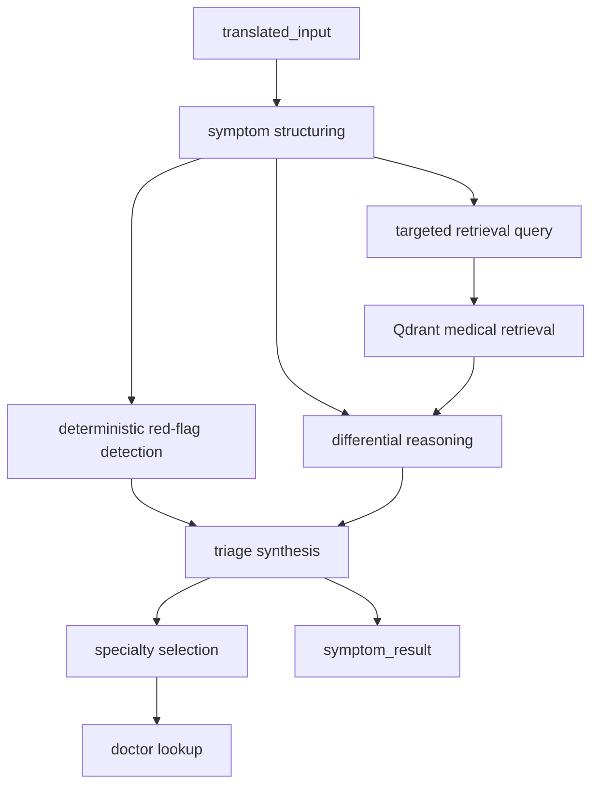

### Current Internal Stages

The new Symptom Checker now performs:

1. symptom structuring
2. deterministic red-flag checks
3. retrieval query construction
4. Qdrant-backed medical context retrieval
5. differential diagnosis reasoning
6. triage synthesis
7. specialty and doctor lookup

### New Symptom Output Shape

The returned `symptom_result` now contains richer fields such as:

- `structured_symptoms`
- `red_flag_analysis`
- `follow_up_questions`
- `confidence_summary`
- `diagnosis_confidence`
- `triage_reason`
- `diagnoses`
- `triage_level`
- `recommended_specialty`
- `red_flags`
- `next_steps`

### Product impact

This is one of the first places where MedMAS has moved beyond a pure single-prompt specialist pattern.

It improves:

- safety through deterministic red-flag logic
- explainability through structured symptom extraction
- retrieval quality through better retrieval queries
- UI usefulness through symptom insights and follow-up questions

## Data and Retrieval Architecture

Current main data sources:

- `data/doctors.csv`
- `data/lab_ranges.json`
- `backend/knowledge_base/medical_docs/*.txt`

Current retrieval/provider behavior:

- symptom flows use structured retrieval queries against the local medical knowledge base
- speech transcription uses DeepInfra's OpenAI-compatible audio API
- doctor discovery prefers live OSM lookup when `user_lat/user_lng` is present
- doctor discovery falls back to `data/doctors.csv` by district and specialty

### Current concern

Retrieval is the least stable architectural area right now. Provider, embedding, vector, and collection assumptions need more explicit ownership and versioning.

Recommended retrieval subsystem:

```text
backend/
  retrieval/
    collection_manager.py
    embedding_registry.py
    index_builder.py
    migration_checks.py
```

Persist metadata for:

- embedding provider
- embedding model
- vector dimension
- collection/index version
- corpus version

## Location and Provider Discovery

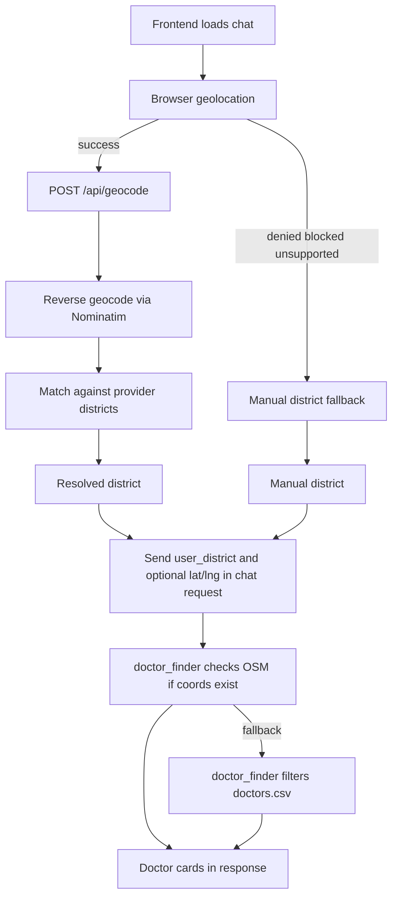

### Assessment

Good:

- practical
- safe fallback
- easy to explain
- supports both live-location and district-only flows
- coordinates are already sent through patient and ASHA chat requests

Weak:

- district-only matching
- limited ranking and quality scoring
- no availability or quality scoring

## Auth and Persistence

Current flow:

- signup uses OTP verification plus Supabase signup
- login uses Supabase password auth
- frontend stores token in localStorage
- backend writes health logs to Supabase
- session-based chat persistence via Supabase

### Auth User Types

1. **Patient/User**: Email + password login via Supabase
2. **ASHA Worker**: Phone + OTP login, linked to patient queue
3. **Doctor**: Email + password login, verified status tracked

### Assessment

Functional, but not yet platform-rigorous.

Main concerns:

- localStorage-only auth state
- limited visible route protection discipline
- persistence logic embedded directly in API handlers
- OTP state is kept in process memory, so it is not durable across restarts

## Current Feature Set

As of the current implementation, the main user-visible capabilities are:

- multilingual text chat
- speech-to-text-assisted chat input
- live-location-assisted district detection
- richer Symptom Checker insights in chat responses
- doctor lookup with OSM-first fallback
- lab PDF upload analysis
- ASHA field assessment workflow
- consult-a-doctor case creation
- prescription writing for doctors
- OTP-backed signup and Supabase login
- session-based chat persistence
- reminders and history APIs

## Testing Status

New backend tests now exist for the Symptom Checker pipeline:

- `backend/tests/test_symptom_checker_v2.py`

Current covered behaviors:

- urgent red-flag detection for chest-pain patterns
- triage synthesis behavior for severe symptom cases
- end-to-end node contract with mocked structuring, retrieval, reasoning, and doctor lookup

This is still unit-test-level coverage, but it is an improvement over the earlier no-test state of the Symptom Checker.

## Main Architectural Gaps

1. repo root is not aligned with app root
2. `backend/main.py` is too broad
3. runtime is mostly single-primary-agent
4. retrieval architecture needs stronger versioning
5. frontend chat page is too large (~1300 lines)
6. memory and state are still request-scoped in practice
7. speech-to-text is integrated, but still lacks retries, fallbacks, and transcript confidence handling
8. the new Symptom Checker pipeline still needs deeper integration tests and follow-up-question workflows
9. platform engineering discipline is thin
10. no dedicated hooks/components for frontend API layer

## Recommended Improvement Roadmap

### Phase 1: Team-safe structure

1. flatten repo root
2. split backend routes by domain
3. clean duplicate or artifact files
4. standardize setup docs and envs
5. add CI, tests, lint, and formatting

### Phase 2: Runtime reliability

1. add structured error envelopes
2. validate provider config at startup
3. formalize retrieval metadata and migrations
4. move persistence behind service or repository boundaries
5. add STT-specific error handling and browser compatibility fallbacks
6. add integration tests for the Symptom Checker chat path

### Phase 3: Real multi-agent evolution

1. support multi-label routing
2. allow parallel specialist execution
3. add synthesis after specialist outputs
4. add confidence-aware fallback logic

### Phase 4: Better care-path intelligence

1. store lat/lng plus district
2. rank providers by distance
3. enrich provider data
4. add stronger ASHA and longitudinal patient workflows

### Phase 5: Frontend organization

1. Extract hooks for API calls
2. Create reusable components
3. Add route protection
4. Centralize auth state management

## Target Future-State Architecture

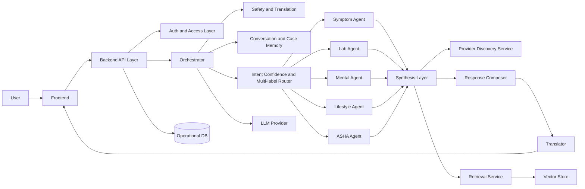

## Bottom Line

MedMAS already has the correct product primitives:

- specialist health roles
- orchestration
- safety-first flow
- multilingual support
- provider discovery
- ASHA workflow
- consult-a-doctor system
- prescription management

The next improvement should focus on:

- modularity for team contribution
- stabilized retrieval and provider boundaries
- deeper orchestration with synthesis
- stronger auth, state, and platform engineering discipline
- frontend code organization

Current state:

`strong prototype architecture`

Desired state:

`modular, team-safe, synthesis-driven health platform`
