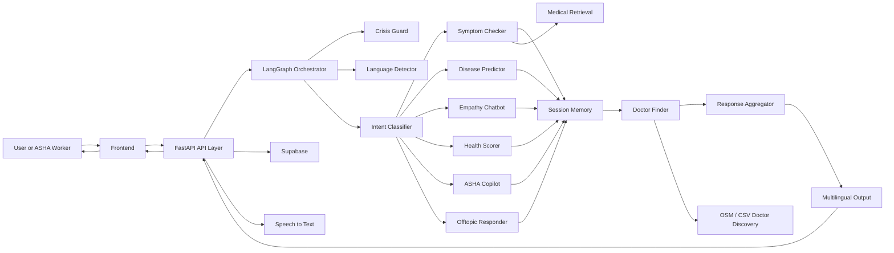
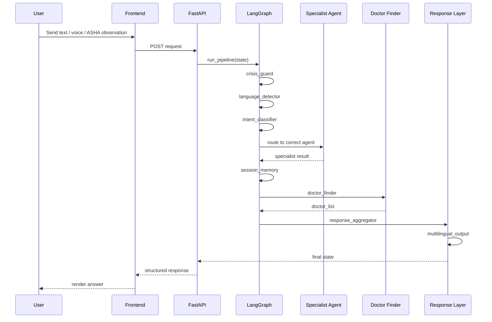
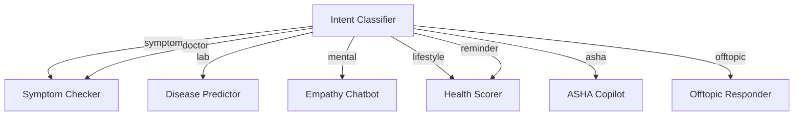
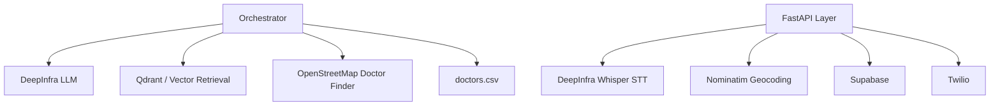
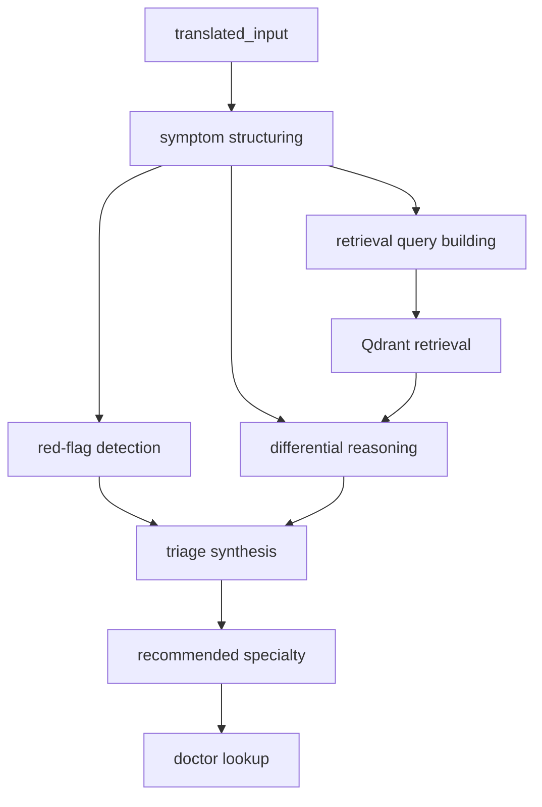
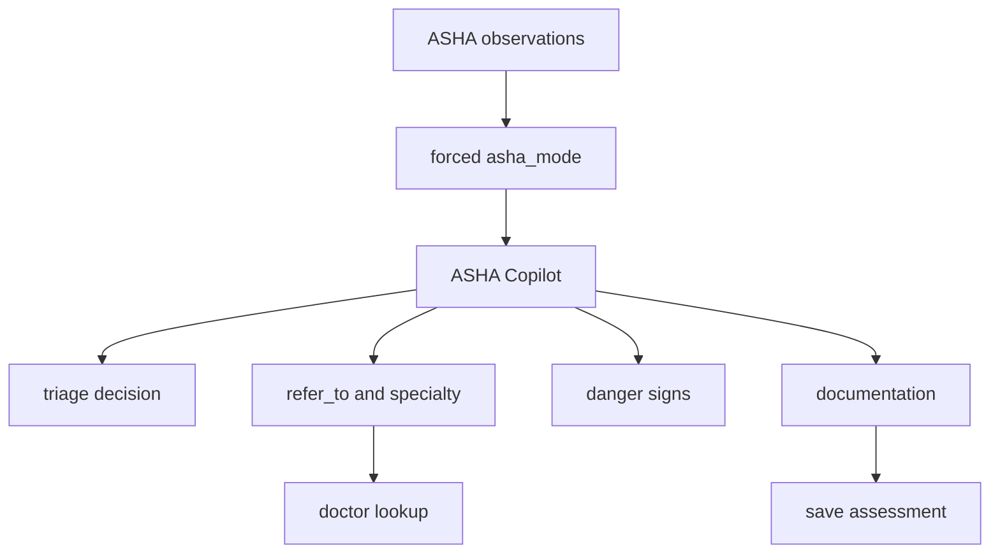
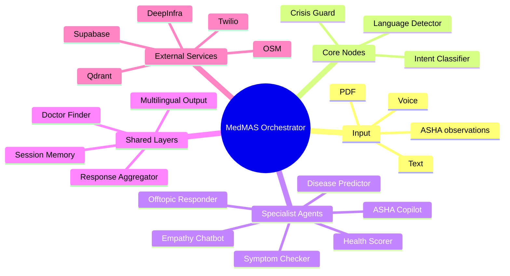

# MedMAS Orchestrator Architecture

## Goal

This document explains the current end-to-end orchestrator architecture of MedMAS.

It is designed for evaluator-facing explanation in Round 1.

It covers:

- the full LangGraph orchestration flow
- all specialist agents
- system nodes and helper services
- input and output structure
- routing logic
- Mermaid diagrams for presentation

## One-Line Definition

MedMAS uses a **multilingual orchestrator pipeline** that takes user input, normalizes it, checks safety, classifies intent, routes it to the correct health specialist agent, enriches the result with doctor discovery, and returns a structured multilingual response.

## Main Components

### User Input Modes

Current supported input modes:

- text chat
- speech-to-text chat
- lab PDF upload
- ASHA field observations

### Orchestrator Entry

Main orchestration entrypoint:

- [orchestrator.py](/D:/MedMAS-AI/MedMAS/medmas/backend/orchestrator.py)

Main execution function:

- `run_pipeline(...)`

Main state contract:

- [state.py](/D:/MedMAS-AI/MedMAS/medmas/backend/state.py)

## Top-Level Architecture



## End-to-End Runtime Flow



## Current Orchestration Order

The current graph order is:

1. `crisis_guard`
2. `language_detector`
3. `intent_classifier`
4. one routed specialist node
5. `session_memory`
6. `doctor_finder`
7. `response_aggregator`
8. `multilingual_output`

## Routing Logic

### Current intent categories

The orchestrator currently supports these intent labels:

- `symptom`
- `lab`
- `mental`
- `lifestyle`
- `asha`
- `doctor`
- `reminder`
- `offtopic`

### Current route map



### Special routing overrides

- if `crisis_guard` already detects crisis with mental-health context, the system forces `mental`
- if `asha_mode=True`, the system forces `asha`

## Agent Definitions

### 1. Symptom Checker

Purpose:

- symptom structuring
- red-flag detection
- differential reasoning
- triage
- specialty recommendation

Use case:

- patient symptom triage
- symptom-driven doctor discovery

### 2. Disease Predictor

Purpose:

- interpret lab-style data
- estimate disease risk
- return urgency and lifestyle recommendations

Use case:

- HbA1c, glucose, BP, lab PDFs

### 3. Empathy Chatbot

Purpose:

- emotional support
- mental-health-sensitive response
- escalation for distress

Use case:

- stress, anxiety, sleep, hopelessness

### 4. Health Scorer

Purpose:

- preventive-health and lifestyle scoring
- action-item recommendations

Use case:

- diet, exercise, sleep, stress, hydration

### 5. ASHA Copilot

Purpose:

- field-triage support for ASHA workers
- referral guidance
- home-care instructions
- documentation support

Use case:

- maternal-child care
- community-health observation triage

### 6. Offtopic Responder

Purpose:

- politely redirect non-medical queries

Use case:

- greetings, jokes, non-health topics

## System Nodes and Tools

These are not specialist agents, but they are essential orchestrator components.

### Crisis Guard

Role:

- runs first on every request
- checks high-risk crisis situations

### Language Detector

Role:

- detects input language
- normalizes into English-like `translated_input` for downstream processing

### Session Memory

Role:

- accumulates outputs from agent steps
- stores cross-agent signals like:
  - top condition
  - symptom triage
  - diabetes risk
  - hypertension risk
  - mental severity
  - high stress

### Doctor Finder

Role:

- resolves doctor/facility recommendations after specialist reasoning
- prefers OSM if user coordinates exist
- falls back to CSV district matching

### Response Aggregator

Role:

- turns structured agent outputs into one final readable response

### Multilingual Output

Role:

- converts the final response into the user’s language

## External Tools / Services Used By The Orchestrator



### Current external dependencies

- DeepInfra
  - LLM inference
  - speech-to-text
- Qdrant
  - medical retrieval for symptom reasoning
- OpenStreetMap / Nominatim
  - nearby doctors
  - reverse geocoding
- `data/doctors.csv`
  - static doctor fallback
- Supabase
  - auth
  - logs
  - ASHA queue/history
- Twilio
  - reminders and OTP messaging

## Orchestrator State Input

The orchestrator consumes a shared typed state object.

Main input fields:

```json
{
  "raw_input": "original user message or transcript",
  "input_lang": "en",
  "translated_input": "normalized English text",
  "media_type": "text|pdf|voice",
  "pdf_bytes": null,
  "user_id": "optional user id",
  "user_district": "optional district",
  "user_phone": "optional phone",
  "user_lat": 23.0,
  "user_lng": 72.0,
  "asha_mode": false,
  "asha_worker_id": null,
  "patient_id": null
}
```

### Input source by flow

Patient text chat:

- `raw_input`
- `user_district`
- optional `user_lat/user_lng`

Voice chat:

- speech first becomes text through `/api/transcribe`
- then enters orchestrator as normal `raw_input`

Lab upload:

- `media_type = "pdf"`
- `pdf_bytes` present

ASHA assessment:

- `asha_mode = true`
- `asha_worker_id`
- `patient_id`
- field observations as `raw_input`

## Orchestrator State Output

Main output fields in final state:

```json
{
  "intent": "symptom",
  "triage_level": "urgent|moderate|routine",
  "symptom_result": {},
  "disease_result": {},
  "empathy_result": {},
  "health_result": {},
  "asha_result": {},
  "doctor_list": [],
  "session_context": {},
  "aggregated_response": "combined English response",
  "final_response": "user-language response",
  "crisis_detected": false,
  "error": null
}
```

## Structured Input / Output by Agent

### Symptom Checker

Receives:

- `translated_input`
- optional user district
- optional coordinates

Returns:

- `symptom_result`
- `triage_level`
- `doctor_list`

Current `symptom_result` includes:

- `structured_symptoms`
- `red_flag_analysis`
- `follow_up_questions`
- `confidence_summary`
- `diagnosis_confidence`
- `triage_reason`
- `diagnoses`
- `triage_level`
- `recommended_specialty`
- `red_flags`
- `next_steps`

### Disease Predictor

Receives:

- lab-related input or parsed report values

Returns:

- `disease_result`
- `triage_level`

### Empathy Chatbot

Receives:

- mental-health-style query

Returns:

- `empathy_result`
- `triage_level`

### Health Scorer

Receives:

- lifestyle-style query or structured health-scoring input

Returns:

- `health_result`

### ASHA Copilot

Receives:

- ASHA field observations
- `asha_mode`
- worker and patient IDs

Returns:

- `asha_result`
- `doctor_list`
- `triage_level`

### Offtopic Responder

Receives:

- non-health query

Returns:

- `offtopic_result`

## Symptom Checker As A Sub-Pipeline

The Symptom Checker is currently the most internally advanced specialist.



This is useful to mention to the evaluator because it shows that MedMAS is not just “one prompt = one answer.”

## ASHA Path As A Sub-Pipeline



## How To Explain It To Evaluators

Use this simple explanation:

“MedMAS is not a single chatbot. It is an orchestrated multi-agent system. Every input first goes through safety and language normalization. Then an intent router sends it to the right specialist agent, such as Symptom Checker, Disease Predictor, Empathy Chatbot, or ASHA Copilot. After that, shared system layers enrich the result with doctor discovery and multilingual output.”

Then add:

“Different user journeys reuse the same orchestrator, but with different specialist paths. That is why one platform can serve both patients and ASHA workers.”

## Strong Demo-Friendly Summary



## Bottom Line

Current orchestrator architecture:

`input -> safety -> language -> intent routing -> specialist agent -> shared memory -> doctor discovery -> response composition -> multilingual output`

That is the clearest way to explain the MedMAS architecture in Round 1.
