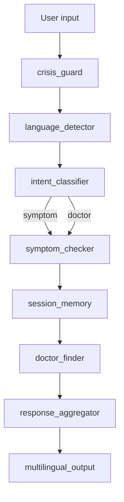
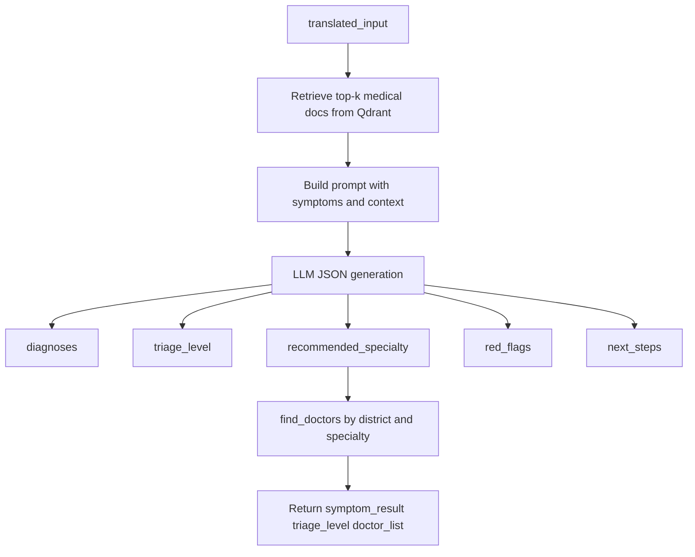
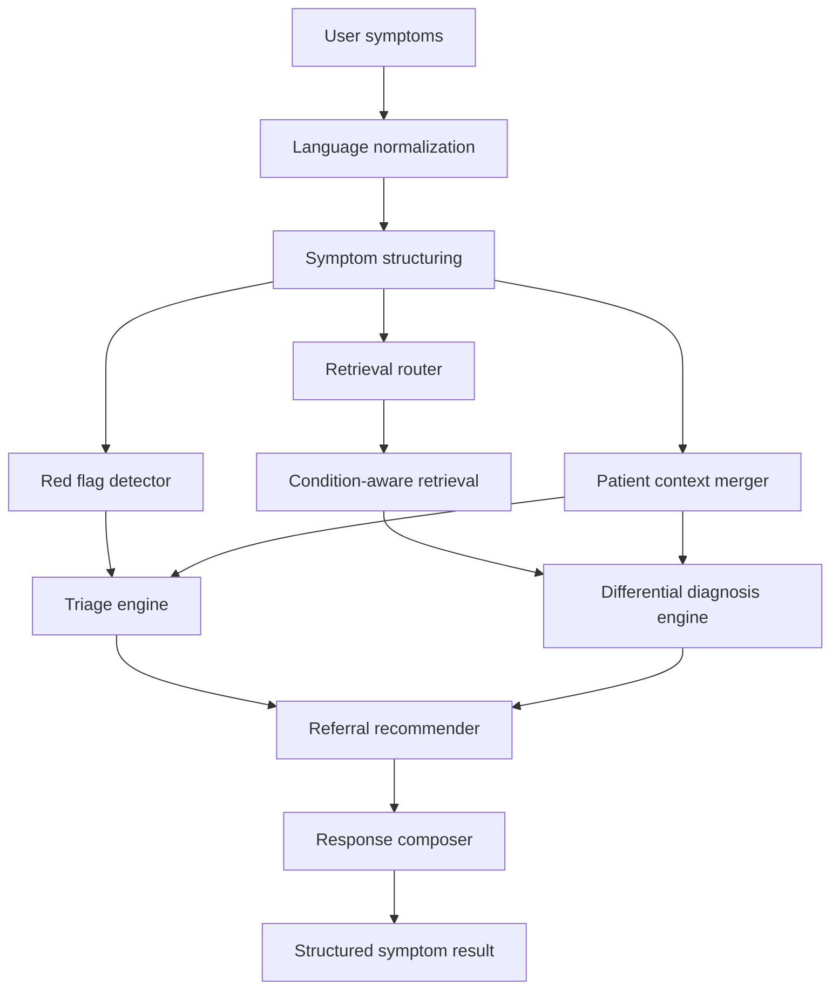
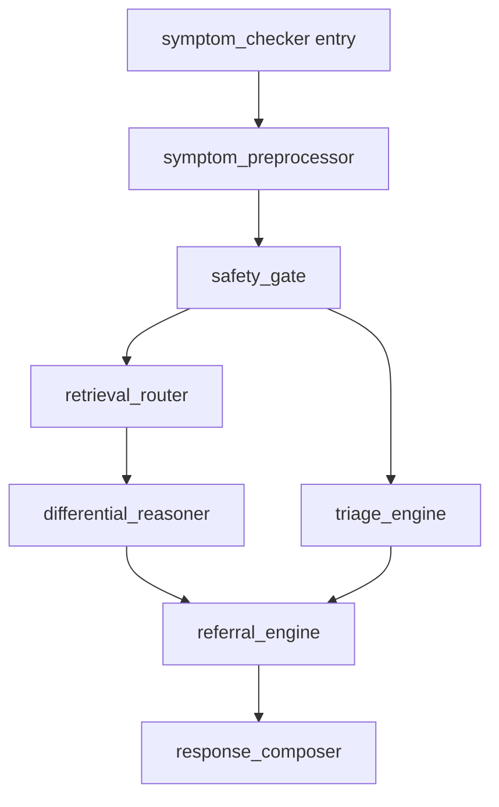

# MedMAS Symptom Checker Architecture

## Purpose

This document defines the current role of the Symptom Checker agent, its limitations, and a better target architecture for improving it into a safer and more reliable triage subsystem.

The goal is not to make the agent a final diagnosis engine.

The goal is to make it a stronger:

- symptom understanding layer
- triage layer
- referral layer
- uncertainty-aware decision support layer

## Current Role

The Symptom Checker is implemented in [backend/agents/symptom_checker.py](/D:/MedMAS-AI/MedMAS/medmas/backend/agents/symptom_checker.py).

It is the main specialist agent for:

- symptom-based health questions
- doctor-seeking queries that need specialty inference
- rural first-line triage support

Today it performs three things in one node:

1. retrieves medical context from Qdrant
2. asks the LLM for differential diagnoses and triage
3. fetches doctors for the recommended specialty

## When It Is Called

It is called by the main orchestrator in [backend/orchestrator.py](/D:/MedMAS-AI/MedMAS/medmas/backend/orchestrator.py).

The Symptom Checker runs when intent is:

- `symptom`
- `doctor`

Current route:



## Current Internal Flow

Current implementation logic:



## Current Output Shape

The current node returns:

```json
{
  "symptom_result": {
    "diagnoses": [
      { "condition": "...", "likelihood": "high|medium|low", "reason": "..." }
    ],
    "triage_level": "urgent|moderate|routine",
    "recommended_specialty": "General|Cardiology|Neurology|Endocrinology|Psychiatry|Paediatrics|Obstetrics",
    "red_flags": ["..."],
    "next_steps": "..."
  },
  "triage_level": "urgent|moderate|routine",
  "doctor_list": []
}
```

## Current Strengths

- simple and easy to understand
- easy to route to
- retrieval-backed instead of pure LLM guessing
- returns usable triage and referral metadata
- works for multilingual chat after translation

## Current Problems

The current design is useful, but too compressed for a serious care workflow.

Main problems:

1. one LLM call is responsible for too much
2. symptom extraction is implicit, not structured
3. red flag detection is mostly prompt-based
4. triage and diagnosis are tightly coupled
5. retrieval is generic and not symptom-domain-aware
6. no confidence scoring is exposed
7. no missing-information or follow-up-question logic exists
8. patient history is not meaningfully used
9. doctor lookup is attached too early inside the node

## Target Architecture

The improved Symptom Checker should become an internal pipeline with separate responsibilities.



## Proposed Subcomponents

### 1. Symptom Structurer

Responsibility:

- convert free text into structured symptom data
- extract duration, severity, location, onset, progression, associated symptoms
- identify demographic clues if present

Suggested output:

```json
{
  "primary_symptoms": ["fever", "headache"],
  "duration": "2 days",
  "severity": "moderate",
  "body_site": "head",
  "associated_symptoms": ["vomiting"],
  "risk_factors": [],
  "missing_critical_info": ["age", "temperature", "neck stiffness"]
}
```

### 2. Red Flag Detector

Responsibility:

- detect emergency patterns before differential reasoning
- use deterministic rules plus LLM support, not prompt-only logic

Examples:

- chest pain with sweating
- shortness of breath
- stroke symptoms
- seizures
- pregnancy with bleeding
- severe dehydration in children

Suggested output:

```json
{
  "detected": true,
  "items": ["shortness of breath"],
  "severity": "high",
  "escalation_reason": "possible respiratory compromise"
}
```

### 3. Retrieval Router

Responsibility:

- choose the most relevant retrieval slice before RAG
- avoid sending generic KB chunks for every symptom complaint

Possible retrieval domains:

- respiratory
- fever/infection
- cardiac
- neurological
- gastrointestinal
- endocrine
- maternal-child
- mental health overlap

### 4. Differential Diagnosis Engine

Responsibility:

- generate ranked differential diagnoses
- explain why each candidate is plausible
- express uncertainty explicitly

Suggested output:

```json
{
  "differentials": [
    {
      "condition": "Viral fever",
      "confidence": 0.71,
      "supporting_evidence": ["fever", "body ache"],
      "missing_evidence": ["rash"],
      "contradicting_evidence": []
    }
  ]
}
```

### 5. Triage Engine

Responsibility:

- compute urgency independently of the diagnosis list
- use:
  - red flags
  - symptom severity
  - duration
  - age or pregnancy context
  - comorbidities if available

Suggested output:

```json
{
  "level": "urgent",
  "time_to_care": "within 6 hours",
  "care_setting": "clinic_or_hospital",
  "triage_reason": "fever with neurological symptoms"
}
```

### 6. Referral Recommender

Responsibility:

- recommend specialty and care pathway
- decide whether the user needs:
  - self-care
  - teleconsult
  - primary clinic
  - hospital
  - emergency referral

### 7. Response Composer

Responsibility:

- convert structured clinical output into simple patient-safe language
- preserve uncertainty
- add clear next steps
- keep rural usability in mind

## Recommended New Output Contract

The node should eventually return a richer `symptom_result`.

```json
{
  "structured_symptoms": {
    "primary_symptoms": ["fever", "cough"],
    "duration": "3 days",
    "severity": "moderate",
    "risk_factors": ["diabetes"],
    "missing_critical_info": ["age", "breathlessness"]
  },
  "red_flags": {
    "detected": true,
    "items": ["shortness of breath"],
    "reason": "possible respiratory compromise"
  },
  "differentials": [
    {
      "condition": "Viral fever",
      "confidence": 0.71,
      "supporting_evidence": ["fever", "body ache"],
      "missing_evidence": ["rash"]
    }
  ],
  "triage": {
    "level": "urgent",
    "time_to_care": "within 6 hours",
    "care_setting": "clinic_or_hospital"
  },
  "referral": {
    "specialty": "General",
    "doctor_priority": "high"
  },
  "next_questions": [
    "Do you have breathlessness?",
    "What is your age?"
  ],
  "patient_advice": "..."
}
```

## Better Orchestrator Placement

At top-level orchestration, the agent can still remain one route named `symptom_checker`.

But internally it should become:



This preserves the outer graph while making the internal design stronger and more testable.

## Data and Model Improvements

### Retrieval Improvements

- split the KB by medical domain
- track corpus version and embedding version
- use symptom-aware retrieval prompts
- keep a fallback path when Qdrant is unavailable

### Prompting Improvements

- separate prompts for:
  - symptom extraction
  - differential reasoning
  - patient response
- do not ask one prompt to do all three

### Rule-Based Safety Layer

- add deterministic red flag rules before LLM reasoning
- make emergency escalation reproducible and testable

### Patient Context

Use future patient state where available:

- age
- sex
- pregnancy status
- chronic disease history
- previous triage results
- medication history

## Best Incremental Upgrade Plan

### Phase 1

- add structured symptom extraction
- split triage from differential generation
- add confidence and missing-info fields

### Phase 2

- add deterministic red flag rules
- route retrieval by symptom domain
- move doctor lookup out of the core diagnosis step

### Phase 3

- use patient history and comorbidity context
- add follow-up question mode for low-confidence cases
- add audit logging for triage rationale

## Expected Benefits

If redesigned this way, the Symptom Checker becomes:

- safer
- easier to debug
- easier to test
- more explainable
- better at handling uncertainty
- better aligned with healthcare triage workflows

## Bottom Line

Current architecture:

`symptoms -> generic retrieval -> one LLM call -> specialty -> doctors`

Recommended architecture:

`symptoms -> structured extraction -> red flag detection -> targeted retrieval -> differential reasoning -> triage -> referral -> patient-safe response`

That is the correct direction if MedMAS wants a stronger, production-grade symptom triage agent.
